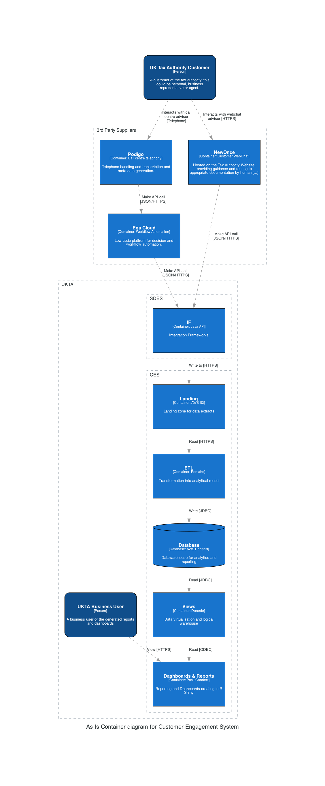

# Architecture Components

## UK Tax Authority Customer
A customer of the tax authority, this could be personal, business representative or agent.

## NewOnce
Hosted on the Tax Authority Website, providing guidance and routing to appropriate documentation by human advisers. Technology: Customer WebChat

## Podigo
Telephone handling and transcription and meta data generation. Technology: Call centre telephony

## Ega Cloud
Low code platform for decision and workflow automation. Technology: Workflow Automation

## IF
Integration Frameworks. Technology: Java API

## Landing
Landing zone for data extracts. Technology: AWS S3

## ETL
Transformation into analytical model. Technology: Pentaho

## Database
Datawarehouse for analytics and reporting. Technology: AWS Redshift

## Views
Data virtualisation and logical warehouse. Technology: Denodo

## Dashboards & Reports
Reporting and Dashboards creating in R Shiny. Technology: Posit Connect

## UKTA Business User
A business user of the generated reports and dashboards.

