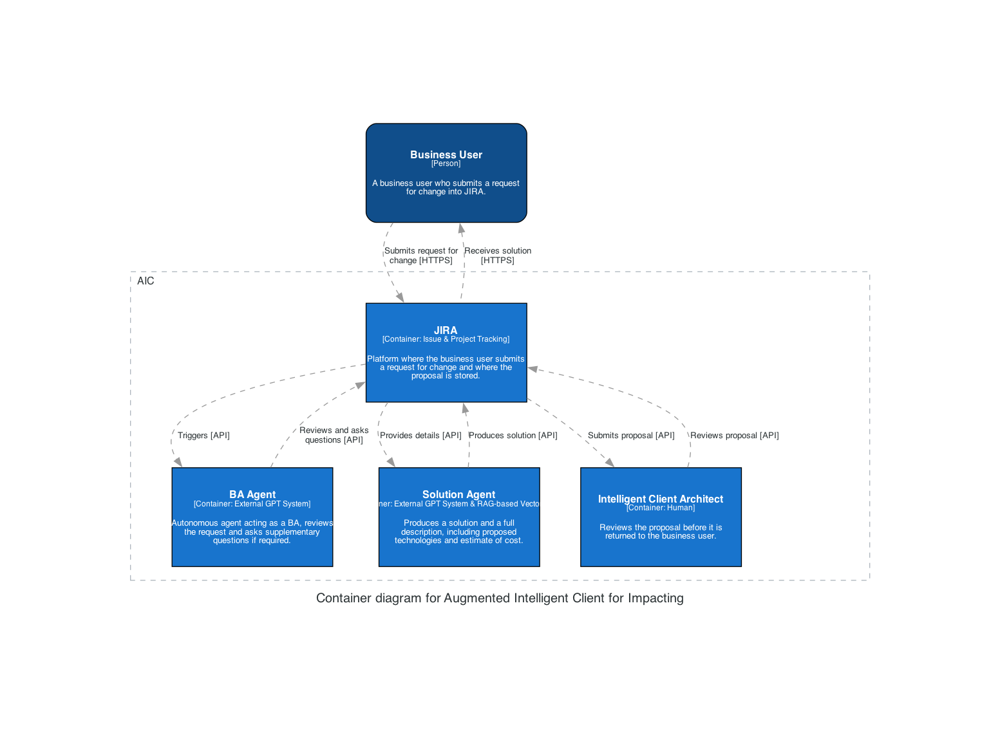

# Augmented Intelligent Client for Impacting - Solution Description

## Components

1. **Business User**: A business user who submits a request for change into JIRA.
2. **JIRA**: Platform where the business user submits a request for change and where the proposal is stored.
3. **BA Agent**: Autonomous agent acting as a BA, reviews the request and asks supplementary questions if required.
4. **Solution Agent**: Produces a solution and a full description, including proposed technologies and estimate of cost.
5. **Intelligent Client Architect**: Reviews the proposal before it is returned to the business user.

## Potential Technology Solutions

1. **JIRA**: Issue & Project Tracking
2. **BA Agent**: External GPT System
3. **Solution Agent**: External GPT System & RAG-based Vector Store
4. **Intelligent Client Architect**: Human

## Proposed Solution Architecture

